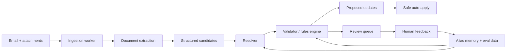

# Approach

## 1. Problem framing

The assignment looks like document parsing on the surface, but the real problem is broader:

- the freshest operational truth often arrives by email
- the incoming data is messy, partial, and sometimes contradictory
- the extracted result must be matched against live operational records
- bad writes do not just create a bad UX, they corrupt supply-chain state

Because of that, I would optimize for **high recall on extraction** but **high precision on automation**.

In other words:
- it is acceptable to extract more candidate information than I automatically trust
- it is not acceptable to auto-write ambiguous updates into production tables

## 1.1 Why this is not just OCR

OCR is necessary, but it is not sufficient.

OCR can tell me that a scanned line says `SKU-13`, `15,000`, and `2026-06-01`.
It cannot, by itself, answer the operational questions that matter:

- does `SKU-13` mean canonical product `SKU-1-3` for this supplier
- should a later email note override the scanned attachment
- is `02/01/2027` safe to auto-write or locale-ambiguous
- is `[Secret] product version 4` a real approved product or a dangerous near-match
- should `terms` and an external reference be written, staged, or preserved as non-schema metadata

That is why I treat extraction as the first stage of a transaction-ingestion system, not the whole system.

## 2. Design principles

1. **LLMs extract, rules decide**
   - Use the model to interpret semi-structured language and documents.
   - Use deterministic logic to resolve entities and gate writes.

2. **Field-level provenance**
   - Every candidate value should keep its source, confidence, and raw text.
   - This matters because one field can be safe while another is not.

3. **Production tables should never be written directly by a freeform model output**
   - Write staged proposals first.
   - Auto-apply only when match confidence and validation rules are strong.

4. **Use existing ERP / DB state as an anchor**
   - PO reference, known supplier, known supplier-product relationships, and current open lines are the strongest signals.

5. **Improve from reviewer corrections**
   - The system should get better from overrides, alias creation, and supplier-specific patterns.

## 3. Minimal robust architecture

### Stage 1: Ingestion
Input:
- raw email body
- attachment bytes
- metadata: sender, thread, timestamps, attachment hashes, message id

Important system behavior:
- compute an idempotency key from `message_id + attachment_hash`
- keep the raw source material for replay and auditing

### Stage 2: Extraction
Use a vision/document-capable model to extract structured candidates from the attachment and free-text updates from the email body.

This repo now includes a minimal live adapter, `app/extract_live.py`, that does exactly that:
- sends the raw email body plus attached PO image to a vision-capable model
- requests structured JSON rather than prose
- writes the result in the same schema the resolver already expects

That adapter is deliberately thin. The important product behavior is not hidden inside framework code. It is visible in the schema, prompt, resolver, and evals.

Example candidate objects:
- purchase order reference candidates
- supplier hints
- line item candidates
- note-based field overrides
- terms / external refs

The output must be schema-constrained, not freeform prose.

### Model selection philosophy

I would start with a single strong vision model for first-pass extraction instead of premature routing complexity.

Selection criteria:
- can it read noisy scanned tables and plain-text email context together
- can it reliably emit structured JSON with low repair overhead
- how does recall degrade on blurred scans, partial crops, and supplier-specific templates
- what are the latency and cost tradeoffs at realistic daily volume
- what do failure modes look like when the model is uncertain

Early-stage bias:
- optimize for extraction recall and failure transparency first
- let deterministic resolution and review gating protect write precision
- only split traffic to cheaper models after replay evals show stable low-risk segments

### Stage 3: Resolution
This is the heart of the system.

Resolver priority for this use case:
1. match the PO by reference number
2. derive the supplier from the PO
3. restrict product matching to products valid for that supplier
4. match line items using:
   - exact supplier SKU match
   - normalized SKU match
   - canonical product SKU match
   - title similarity as supporting evidence only
5. link to the existing `purchase_order_line` record if one exists

This is where the problem differs from many generic automation tasks.
The hard part is not only extracting text. It is **binding noisy extracted text to the correct operational entity**.

### Stage 4: Validation
Rules determine what is safe.

Examples:
- never auto-create a new product from one noisy supplier document
- do not mutate master data from weak evidence
- flag suspiciously earlier dates
- treat slash dates like `02/01/2027` as ambiguous unless supplier locale policy is known
- if a newer email note conflicts with an older scanned attachment, prefer the newer signal but still require review if the new value is ambiguous
- line totals should not overwrite supplier master pricing if the schema does not support PO-line pricing

### Stage 5: Apply or escalate
Output goes to a staging layer such as `proposed_updates`.

Each proposed change should include:
- target table + record id
- field name
- old value
- new value
- source
- confidence
- validation status
- decision: `auto_apply` or `review`

### What is automated vs what is review-gated

Automated in this sample:
- exact PO match to `PO-12`
- `SKU-2` quantity and date update
- `SKU-3` quantity update

Review-gated in this sample:
- `SKU-3` delivery date because it moves materially earlier than the current PO state
- `SKU-1-3` email ETA override because `02/01/2027` is locale-ambiguous
- `SKU-7` because it does not safely match a supplier-approved product
- `terms` and `external_purchasing_ref_number` because the sample schema has nowhere safe to write them

## 4. Sample walkthrough

Using the provided sample:

### PO match
The scanned document has `Purchasing ref # 12`, which resolves to `PO-12`.
That identifies the operational context and its supplier.

### SKU resolution
- `SKU-13` resolves to canonical `SKU-1-3`
  - normalized supplier SKU match
  - title similarity supports the match
- `SKU-2` and `SKU-3` match directly
- `SKU-7` does not safely match any supplier-approved product

### Update decisions
**Auto-apply**
- `SKU-2`: quantity and delivery date update
- `SKU-3`: quantity update only

**Review**
- `SKU-3` delivery date because it moves materially earlier and looks suspicious
- `SKU-1-3` updated ETA from the email body because the slash date is ambiguous
- `SKU-7` because it cannot be safely matched

**Ignore / preserve as metadata**
- line totals that do not map to the current schema
- `terms` and `external_purchasing_ref_number` because they are not represented in the sample schema

This gives a system that is useful immediately without pretending all ambiguity is solved.

## 5. What data I would trust most

Strong signals:
- existing purchase order reference numbers
- PO -> supplier relationship
- supplier-product mapping
- historical reviewed corrections

Weak or medium-strength signals:
- OCR text alone
- slash-formatted dates
- free-text product titles
- prices without schema context
- isolated supplier notes without record anchors

## 6. Monitoring and evaluation

This problem needs production observability and replay evaluation from day one.

I would track:
- auto-apply rate
- review rate
- unmatched line rate
- reviewer override rate
- extraction confidence distribution
- duplicate email rate
- parse failure rate
- supplier-specific drift
- latency and cost by extraction model

For evaluation, I would build a replay set from historical supplier emails, attachments, extracted JSON, and reviewed outcomes.
That enables:
- prompt iteration
- model comparison
- threshold tuning
- regression testing before rollout

The key point is that evals should operate on **saved raw events**, not hand-written synthetic summaries.
That makes model changes auditable and reproducible.

This repo now includes a minimal example of that discipline in `app/eval_sample.py`:
- it runs the resolver on a real sample extraction payload
- it emits a machine-readable pass/fail report
- it checks the behaviors that matter operationally, not only that the code executed

As the system matures, I would extend that into:
- per-supplier eval slices
- confusion sets for near-match SKUs
- date-normalization edge cases
- regression suites tied to reviewer overrides

## 6.1 Observability and feedback loop

The metrics alone are not enough. I want enough stored context to explain every bad decision quickly.

For each event I would retain:
- raw email metadata and body
- attachment hash and stored source bytes
- extraction model name, prompt version, latency, and cost
- extracted structured JSON
- resolver output
- auto-apply vs review decision
- reviewer override, if any

That gives a tight improvement loop:
1. detect drift or a spike in review rate
2. inspect concrete failing events
3. adjust prompt, thresholds, or supplier alias memory
4. replay evals before rollout
5. measure whether production behavior improved or regressed

## 7. How it improves over time

The system should improve mostly through data and feedback, not constant developer intervention.

Improvement loop:
1. ingest new event
2. extract structured candidates
3. resolve against current state
4. route ambiguous cases to review
5. store reviewer corrections
6. learn supplier SKU aliases and template quirks
7. replay evals before changing prompts, models, or thresholds

Examples of memory worth retaining:
- supplier-specific SKU aliases
- known date formats by supplier or region
- supplier document layout families
- known false positives and false matches

## 8. Why this generalizes beyond purchase orders

The same pattern works for transfer orders, work orders, shipments, and other transaction types:
- the extraction schema changes
- the matching logic changes
- the validators change
- the staged update + review architecture stays the same

That is why I would build the fundamental system as a **transaction ingestion framework** rather than a one-off PO parser.
